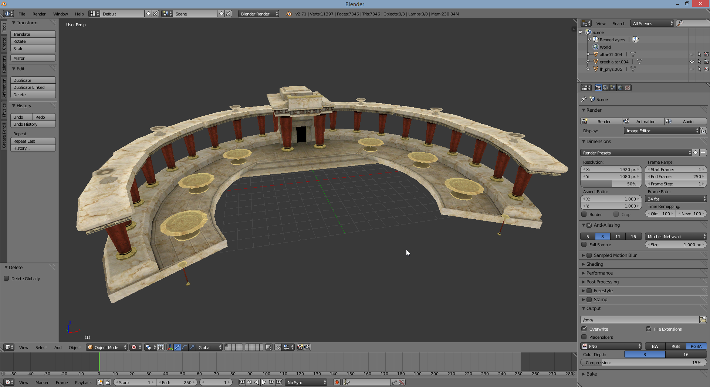
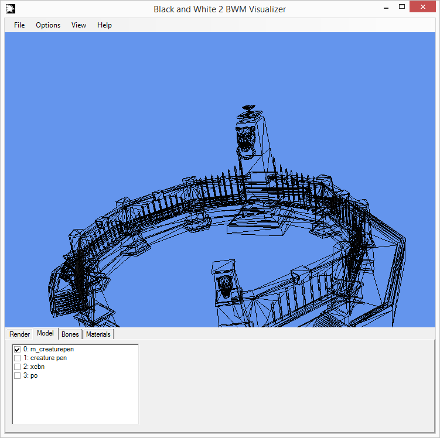

## Description

The format `bwm` is an abbreviation for `Black & White Model`. As is the name
the format is used to describe in-game 3D models, it is built up of many
different data definitions such as: vertices, faces, materials, meshes, bones,
entities, etc..

A lot of this format is still unknown to me, but enough is known to read and
render static meshes.




At the end of this page you can find an [ImHex](https://imhex.werwolv.net/) Pattern corresponding to this file format. 

## File Format

### Header
The file has a header identifying the file format and version: ASCII
`LiOnHeAdMODEL`, followed by `27 bytes` of null padding. Followed by a `uint32`
possibly describing the version. Then followed again by another `uint32` that
must be set to `0x2B00B1E5`. :smirk:

A lot of the header is completely unknown to me, but enough is known to read
a model's geometry :

```
char[40] magicFileIdentifier; //'LiOnHeAdMODEL' followed by 27 bytes of padding
uint32_t size; //Size of the file minus the size of this value and of magicFileIdentifier
uint32_t magicNumber; // Must always be 0x2B00B1E5
uint32_t version; // Version of the file format only encoutered version 5 or 6
uint32_t metadataSize // Size of all data definitions, in practice it is the
// beginning of the vertex minus 56 bytes

float unknown;
float[3] pnt;
float[3] box1; //First point of a bounding box
float[3] box2; //Second point of a bounding box
float[3] center;
float height;
float radius; //Also define the distance to snap the building to the road
uint32_t unknown2; //Always 0, 1 or 2
float volume;

uint32_t numMaterialDefinitions;
uint32_t numMeshDescriptions;
uint32_t numBones;
uint32_t numEnts;
uint32_t numUnknown1; // Count the number of an entity whose purpose is unknown
uint32_t numCollisionPoint; // Count the number of an entity whose purpose is unknown
char[20] unknown3;
uint32_t numVertex;
uint32_t numStrides;
uint32_t type; //Tell if the file is a model or a skin (model for people and animal) it determines the step to make for 
// each faces (if 3 then 1, if 2 then 3) in the table of indes to build a face.
uint32_t numIndices;
```

### Material Definition
A series of 8 table of 64 char containing the name of the texture used.
The table can be an empty string meaning material won't use it (no normals if normalMap 
is empty).

```
char[64] diffuseMap;
char[64] lightMap;
char[64] growthMap;
char[64] specularMap;
char[64] animatedTexture;
char[64] normalMap;
char[64] type;
```

### Mesh Description Definition
```
uint_32 facesCount;
uint_32 indiciesOffset;
uint_32 indiciesSize;
uint_32 vertexOffset;
uint_32 vertexSize;
float[3] axis1; //First axis of a rotation matrix
float[3] axis2; //Second axis of a rotation matrix
float[3] axis3; //Thirs axis of a rotation matrix
float[3] position;
float[3] center;
float radius; // Control collison with the god hand
float[3] box1;
float[3] box2; 
char[20] unknown2;
uint32_t unknown_int;
float volume;
uint_32 materialRefsCount;
char[4] unknown2;
uint_32 lod_level;
char[64] name;
```

### Material Reference Definition
This section is stocked in the file right after the mesh definition. There are a number of material references equal to the sum of materialRefsCount for each mesh description. For example if you have 2 mesh with 2 material references this section will contain 4 material references the first two for the first one and the last two for the second one.
```
uint_32 materialDefinition;
uint_32 indiciesOffset;
uint_32 indiciesSize;
uint_32 vertexOffset;
uint_32 facesOffset;
uint_32 facesSizes;
char[4] unknown2;
```

### Bone Definition
Define the position and orientation of a bone, information on the skeleton are found in [.al](/file_formats/al.md) files
```
float[3] axis1; //First axis of a rotation matrix
float[3] axis2; //Second axis of a rotation matrix
float[3] axis3; //Thirs axis of a rotation matrix
float[3] position;
```

### Entity definition
```
float[3] axis1; //First axis of a rotation matrix
float[3] axis2; //Second axis of a rotation matrix
float[3] axis3; //Thirs axis of a rotation matrix
float[3] position;
char[256] name
```

### Entity Unknown1:
```
float[3] point;
```

### Collision point:
This array of point is the footprint used to check for collision when placing building. It seems to be mostly usefull to check collision when placing the building, deleting it allow to build on existing road but not near building with valid collision footprint. Another set of data control the minimum collision inside the header. Testing show that collision check or not reversible (placing a temple then a hovel can allow for placement that are invalid the other way).
```
float[3] point;
```

### Stride
This structure tell the number of stride to take in the following data block and how data is to be read during each stride. For instance if `idSize` contains `[0, 2, 1, 2, 2, 1, 2, 1, 2, 1]` the odd indicies seems to correspond to a data type (yet to be confirmed), the even indicies indicate which format of data to read. In this example we have 5 data structure of id `[0, 1, 2, 2, 2]` and format `[2, 2, 1, 1, 1]`. Data to size correspondence are as follow :
- 0 or 3 = 4 bytes
- 1 = 12 bytes
- 2 = 8 bytes
- 4 = 1 byte
```
uint_32 count;
uint_32 idSize[2*count];
uint_32 unknown[136 - (2*count)]; //Presumed to be garbage
````
### Stride organized data
The data structure defined in strides are repeated for the number of vertex defined in the file.

#### Vertex
This section is defined by the first stride (or stride 0), it is usually comprised of the vertex position and its normal with a tuple for uv coordinates.
```
float[3] position;
float[3] normal;
float[2] uv_texture;
// End of common vertex definition
float[2] uv_ligthmap;
float[2] uv_plants;
```

#### Bone weight
In skins you find 8 more strides, they link the vertex with the bones with a bone index/weight scheme, each vertex is associated to at most 4 different bones.
From stride 1 to 4 you find.
```
char boneIndex; //Index of the bone
```
From stride 5 to 8 you find.
```
float boneWeight; //How much the bone impact the vertex during animation
```

### Indices
A table of `uint_16` containing index for the vertex array. The way to extract faces differs if your file contain a model or a skin (you'll need to move by 3 for each face for a model and by one for a skin).
```
uint_16[numIndices]
```

### Model Cleaves
Named like this in bwmTool reader, don't know what it's used for.
```
uint_32 modelCleaveCount;
float[3] modelCleave[modelCleaveCount]
```

# A pattern to use with ImHex

```C
#pragma pattern_limit 1000000
struct header {
	char idString[40];
	u32 size;
	u32 magicNumber;
	u32 version;
	u32 metadataSize;
	float unk1;
	float pnt[3];
	float box1[3];
	float box2[3];
	float cent[3];
	float height;
	float radius;
	u32 unk2;
	float volume;
	u32 matDefCount;
	u32 meshDescCount;
	u32 boneCount;
	u32 entityCount;
	u32 unkCount;
	u32 collCount;
	float unk3;
	float unks2[3];
	float unk4;
	u32 vertexCount;
	u32 strideCount;
	u32 type;
	u32 indexCount;
};

header head @ 0x00;

struct matDef{
	char diffuse[64];
	char light[64];
	char growth[64];
	char specular[64];
	char animation[64];
	char normal[64];
	char type[64];
};

matDef matDefs[head.matDefCount] @$;

struct matRef {
	u32 matDesc;
	u32 indiceOff;
	u32 indiceSize;
	u32 vertexOff;
	u32 vertexSize;
	u32 faceOff;
	u32 faceSize;
	float unk;
};

struct meshDesc {
	u32 faceCount;
	u32 indiceOff;
	u32 indiceSize;
	u32 vertexOff;
	u32 vertexSize;
	
	float zaxis[3];
	float xaxis[3];
	float yaxis[3];
	float position[3];
	
	float cent[3];
	float radius;
	float box1[3];
	float box2[3];
	float unks[3];
	float height;
	float unk1;
	
	u32 unk_int;
	float volume;
	u32 matRefCount;
	u32 u2;
	u32 lod_level;
	char name[64];
	u32 unks3[2];
	
};

meshDesc meshDescs[head.meshDescCount] @$;

fn matRefCount() {
	u32 i = head.meshDescCount;
	u32 refCount = 0;
	while (i > 0) {
		i -= 1;
		refCount += meshDescs[i].matRefCount;
	}
	return refCount;
};

matRef matRefs[matRefCount()] @$;

struct bone {
	float zaxis[3];
	float xaxis[3];
	float yaxis[3];
	float position[3];
};

bone bones[head.boneCount] @$;

struct entity {
	float zaxis[3];
	float xaxis[3];
	float yaxis[3];
	float position[3];
	char name[256];
};

entity entities[head.entityCount] @$;

struct unk {
	float position[3];
};

unk unks[head.unkCount] @$;

struct coll {
	float position[3];
};

coll colls[head.collCount] @$;

struct stride {
	u32 size;
	u32 idSize[2*size];
	padding[0x84 - 8*size];
};

stride strides[head.strideCount] @$;

struct vertex {
	float position[3];
	float normal[3];
	float uv[2];
	if (strides[0].size > 3)
		float lightuv[2];
	if (strides[0].size > 4)
		float unkuv[2];
};

vertex vertices[head.vertexCount] @$;
u16 indexes[head.indexCount] @$;
```
